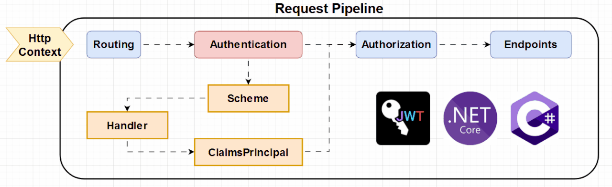

# Sistema de Autenticação com ASP.NET Core e JWT

Este projeto demonstra a implementação de um sistema de autenticação utilizando ASP.NET Core, Identity e JSON Web Tokens (JWT).

## Visão Geral

O sistema de autenticação permite que usuários façam registro, login e logout, gerando tokens JWT para autenticação segura em APIs. O fluxo de autenticação garante que apenas usuários autenticados possam acessar recursos protegidos.

## Fluxo de Autenticação

1. **Registro**: O usuário cria uma conta fornecendo um nome de usuário, email e senha.
2. **Login**: O usuário faz login com email e senha. Se as credenciais forem válidas, um token JWT é gerado.
3. **Autenticação**: Para acessar recursos protegidos, o usuário deve fornecer o token JWT no cabeçalho da requisição.
4. **Logout**: O usuário pode fazer logout, invalidando a sessão atual.

## Fluxograma do Processo de Autenticação



## Endpoints

- `POST /api/account/register`: Registra um novo usuário.
- `POST /api/account/login`: Faz login e gera um token JWT.
- `POST /api/account/logout`: Faz logout do usuário autenticado.

## Requisitos

- .NET 8 ou superior
- Visual Studio Community 2022 ou Visual Studio Code
- Banco de dados PostgreSQL (ou outro banco de dados configurado)

## Executando o Projeto

1. Clone o repositório e navegue até a pasta do projeto.
2. Configure as variáveis de configuração no arquivo `appsettings.json`.
3. Execute os comandos abaixo para restaurar os pacotes e rodar a aplicação:

    ```bash
    dotnet restore
    dotnet run
    ```

4. A aplicação estará disponível em `http://localhost:5000`.

## Uso do Token JWT

Para acessar endpoints protegidos, inclua o token JWT no cabeçalho `Authorization` da requisição:

```http
Authorization: Bearer <seu_token_jwt>
```
## Tecnologias Utilizadas

- ASP.NET Core
- Entity Framework Core
- JWT (JSON Web Tokens)
- Swagger para documentação da API

## Contribuição

Sinta-se à vontade para contribuir com melhorias para este projeto. Abra uma issue para discutir mudanças que você gostaria de fazer.

## Licença

Este projeto está licenciado sob a [MIT License](LICENSE).

## Imagem do Fluxo de Autenticação

Você pode criar uma imagem ilustrativa do fluxo de autenticação utilizando ferramentas como [draw.io](https://www.draw.io/) ou qualquer outra ferramenta de diagramação. Após criar a imagem, salve-a como `authentication-flow.png` na pasta raiz do projeto. Aqui está uma descrição de como seria o fluxo visualmente:

1. **Registro**:
    - O usuário envia nome de usuário, email e senha.
    - O servidor valida os dados e cria a conta.
  
2. **Login**:
    - O usuário envia email e senha.
    - O servidor valida as credenciais e gera um token JWT.

3. **Autenticação**:
    - O usuário envia o token JWT no cabeçalho da requisição.
    - O servidor valida o token e, se válido, permite o acesso ao recurso protegido.

4. **Logout**:
    - O usuário requisita o logout.
    - O servidor invalida a sessão.

## Conclusão

Este `README.md` proporciona uma visão geral do sistema de autenticação, descreve os endpoints disponíveis e inclui instruções de configuração e execução. A imagem ilustrativa ajudará a entender o fluxo de autenticação de maneira visual. Sinta-se à vontade para ajustar conforme necessário!